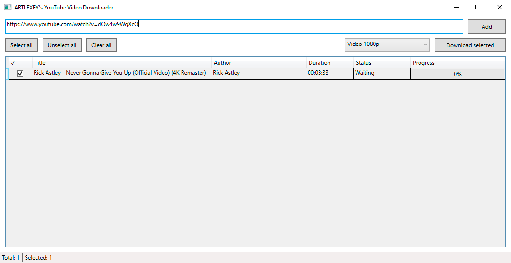

# YouTube Video Downloader

**A desktop YouTube downloader. Prebuilt application archives are available in the Releases section.**

## Features

- Download single YouTube videos/shorts
- Download entire playlists
- Download video with audio
- Download audio only (MP3)
- Select download quality
- Batch download multiple videos
- Download progress tracking
- Download status tracking
- Open downloaded file location
- Multi-select support
- Context menu actions

---

## Screenshots



---

## How to Use

### 1. Add video or playlist

Paste a YouTube video or playlist URL into the input field and click the `Add` button.  
The videos will appear in the table.

### 2. Select videos

Use the checkboxes to select videos you want to download.  

### 3. Choose download format

Select a preset from the top-right dropdown.  
**Examples:**

- MP3 128 kbps
- MP3 192 kbps
- Video 360p
- Video 720p
- Video 1080p

### 4. Download

Click the `Download Selected` button.  
Downloaded files will be saved into:

```
[YouTubeVideoDownloader Folder]/Downloads/
```

---

## Technologies

This project uses:

- WPF
- MVVM architecture
- Dependency Injection
- CommunityToolkit.Mvvm
- YoutubeExplode
- FFmpeg

**FFmpeg is used for:**

- MP3 conversion
- Video/audio merging

---

## Build

### Requirements

- .NET SDK
- Windows
- FFmpeg.exe in /Tools folder (Download FFmpeg from the official website https://ffmpeg.org/download.html)

### Run

```bash
git clone ARTLEXEY/YouTube-Video-Downloader
```

Open the solution in Visual Studio and run the project.

---

## Architecture

- MVVM
- OOP
- Dependency Injection
- Service abstraction
- Reactive UI updates
- Separation of concerns

---

## License

This project is for **educational purposes**.
